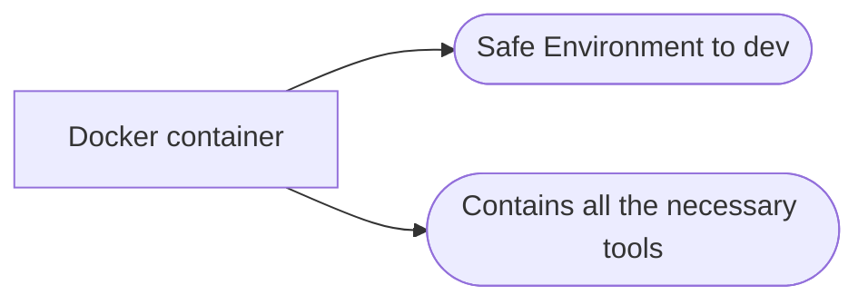

# wiValgrind Container setup

A container designed to provide a flexible Linux environment for development. Simply execute the start.sh script in the working directory using the ```dev``` alias after installation. See the installation and usage guide below. 

This container provides several programs to allow the user to program in c, c++, python, and allows for the development of web applications using npm package manager.

Specific to 42 student users, a program named norminette is also provided allowing the student to check their coding standards for .c, .cpp, .h, and .hpp files.

### Components:
1) Dockerfile - provides blueprint for the image to be built.
2) docker-compose.yml - builds the image
3) install.sh - a script that is executed to initialize the built
4) start.sh - a script to start and run the container in interactive mode with the current working directory.

### Ports & network
Ports 80:80 and 8080:8080 - this allows the user creating a web application to set the server to listen on either port 80 or 8080. Example in package.json:
```javascript
"scripts": {
    "dev": "vite --port 80 --host",
    "build": "vue-tsc && vite build",
    "preview": "vite preview --port 80 --host"
  }
```
Within my vite web application I can specify which port to listen to with the --port argument. I recommend either doing it this way, or using vscode's port forwarding
option after attaching vscode to the container using the docker extension.
---
### Current Packages not limited to:
1) vim
2) curl
3) git
4) make
5) g++
6) gcc
7) zsh
8) valgrind
9) net-tools
10) python3
11) python3-pip
12) norminette
13) weechat
14) irssi
15) nodejs
16) npm

Please feel free to add or suggest more
---

### Installation dependencies
Ensure that the following are installed before attempting to install and build the container:
1) docker
2) git
---
### install:
Run the following command to install on your system:
```bash
sh -c "$(curl -fsSL https://raw.githubusercontent.com/jsjohn1951/wiValgrind/main/install.sh)"
```
### Warning
This question pertains to the existence of a goinfre directory.
Only answer 'y' to the following question if you are currently stationed at a 42 lab machine:
	->	Installing on a 42 lab machine? ( y/n )
Otherwise answer 'n' if you are working on your personal laptop and continue with the installation.

Answer questions given:
```bash
Installing on a 42 lab machine? ( y/n ) y
Is docker installed? ( y/n ) y
Is git installed? ( y/n ) y
Are you using zsh? ( y/n ) y
```
Following this the container will build which may take a few minutes.
After the "Good news, your image is built! 🥳" message, close the terminal
and reopen a new terminal.

---
### Usage
After a successful install the install script would have added an alias for 'dev' within your .zshrc if you are using zsh, otherwise
in your .bashrc. This alias allows the user to type 'dev' into the terminal to call the start.sh script which starts the container.
The current working directory is bind-mounted to the container allowing changes inside to parallel and persist outside.

In order to use the container the user must first navigate to the project source directory. Following type
```bash
dev
```
and the container will launch with access to all your files from inside the container.
---

You're Welcome 🤓