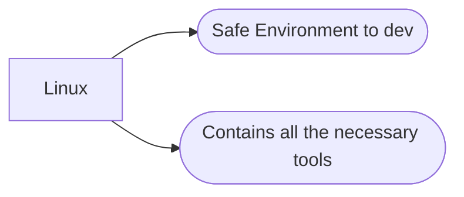

# wiValgrind Container setup

A container designed to provide a flexible Linux environment for development. Simply execute the start.sh script in the working directory using the ```wistart``` alias after installation.

### Components:
1) Dockerfile - provides blueprint for the image to be built.
2) docker-compose.yml - builds the image
3) install.sh - a script that is executed to initialize the built
4) start.sh - a script to start and run the container in interactive mode with the current working directory.


### install:
Run the following command to install on your system:
```bash
sh -c "$(curl -fsSL https://raw.githubusercontent.com/jsjohn1951/wiValgrind/main/install.sh)"